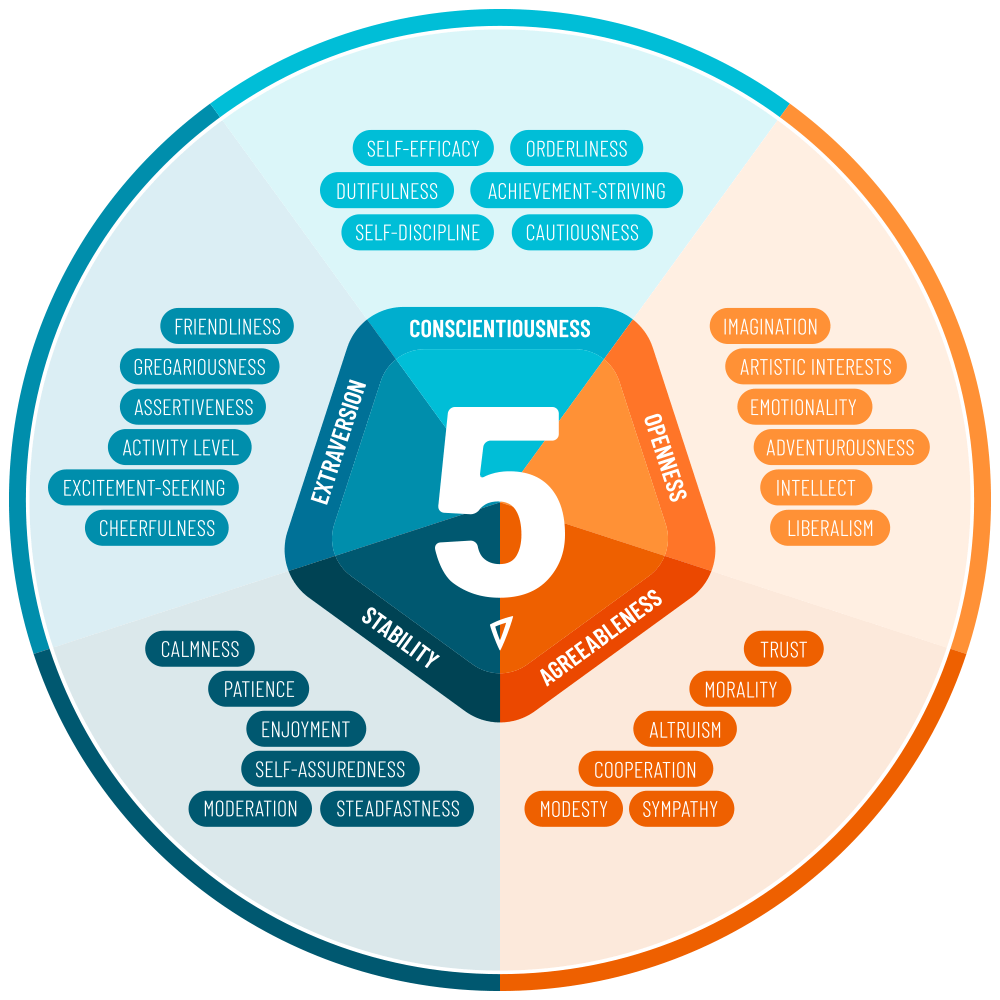

# IT公司的几点问题

最近这些天，有机会和一些本地公司的负责人做了一些交流。这些公司都属于IT行业，他们有丰富的业务经验，但我发现他们在某些方面还是存在一定的误区。

# 1.决策

在过去十多年的时间里，我观察过很多公司的决策，自己也做过很多公司的决策。

 **我发现大多数人很难认识到公司的决策是一件极其复杂的事情。**

这些决策一般包括：开展一个新的业务，招聘高管，开发一个新的产品，采用一个新的管理方式。

大多数人还是习惯于使用思考的方式，去对决策得出一个结论。实际的情况一般是：决策的复杂程度会远超我们的思考能力，让我们不能单纯的依靠思考就能得出结论。要知道通过研究决策理论，好几个人获得过诺贝尔经济学奖。

虽然如此，但我同时也发现，越是经营时间长的负责人，在面对决策时会越谨慎、做出决策的时间会越长。

**绝大多数公司的决策者都会在没有真正得出合理结论的时候，就开始下决策。**

这可能是因为：时间的关系。即使没有定论也要下一个定论，时间到了必须要有一个决策。还有可能是，一些决策可能带来的损失并不太大，所以，即使决策错误，也没有太大问题。

**决策的影响：**

对于很多大公司来说，这些决策可能由于公司的体量庞大、有一定的内部容错能力，所以错误的决策并不一定会对公司本身产生巨大的影响。例如：虽然错误的开发了一个产品，但由于开发的新产品很多，一个错误的产品并不会导致什么巨大的问题。

而对于小公司而言，这些决策带来的问题是巨大的。例如：错误的开发了一个产品。小公司的经济实力有限，一年也就只能开发2-3个产品，一个产品的失败带来的连锁反应可能是巨大的。团队丧失信心、团队被拆解、人员出走或被解雇、公司领导对团队丧失信心，这些都可能会直接影响未来几年公司的走向。

这里就比较反直觉了。一般大家都会认为大公司的决策肯定是周密而谨慎的，小公司的决策是快而灵活的。

**决策的实际情况是**：

大公司由于有足够的容错能力，所以很多决策可以是随意而错误的，这样的决策错误并不会影响大公司的实际发展，这样的决策可以长期在大公司内存在。

小公司的决策虽然快而且灵活，但这样的决策往往错误，从而导致公司一个部门或者一个业务陷入明显的困境中，给公司带来极大的负担，甚至导致公司的倒闭。

**这就是小公司倒闭的比率远大于大公司的直接原因：缺少容错，单一决策错误导致损失巨大！**

**小公司决策的制定与执行更应该慎重。**

这里我引用麦肯锡咨询公司资深合伙人奥利维耶·西博尼的建议是：如果你没有一个清晰的答案，你可以先不用去做出一个决策。多找相关的人咨询，对你得出答案会有帮助。

# 2.招聘

我作为一个从2005年就开始招聘程序员的人，这十多年间我看过了几千份简历，招聘过了几百人。

**问题1：我发现对很多公司来说，招聘的时候很容易陷入到单一观点的陷阱。例如：找高手、找本科生、找便宜的，找能吃苦的，找做过这个工作的，找大厂出来的等等**

### **招聘本身也是件复杂的事情。**

你需要从更多角度来看待这个问题。

**从根本上来说，公司希望的是：用尽可能低的成本，构建一个出色的团队，完美的完成公司的一个目标。**

这里，你会发现两个明显矛盾的地方：低成本与好结果。正常情况下，低成本不会带来好结果，但这就是公司层面追求的东西。

如果是高成本—>好结果。那很可能你的好结果带来的利润不足以超过你的成本，你就亏损，你的招聘就没有意义。

如果是低成本—>差结果。业务失败，会让招聘也没有意义。

**所以这里的公式很简单：  成本 < 结果**

很多时候，我们可能不清楚结果是什么，或者无法准确评估结果。这时我们就需要尽量压低成本，但这成本也不能太低，太低会导致业务失败。

**针对这种现状，追求性价比就成了我们的选择方向。什么样的员工性价比高？**

回答这个问题前，我们先看看从普遍意义上说，

### 什么样的员工是好员工?

1.**有自驱力的员工**。

自驱力是近年来我们常听到的一个话题。在《奈飞文化手册》一书中，开始就说到：“伟大的团队是这样的团队：其中的每一位成员都知道自己要前往何方，并愿意为此付出任何努力。”这就是自驱力。自驱力可以说是一剂万能解药，它可以帮你解决很多常见问题。包括：员工能力不足，态度不端正，管理困难等等。
对于有自驱力的员工，在他进入公司的时候只拿到与他当前水平相符的工资。但由于他有自驱力，在公司的这几年中，他的个人能力大幅增长，而他的薪资按照正常水平可能增加20-30%。这时对于公司来说就获得了他的能力溢价部分。即使公司按照他的实际能力水平去支付他的工资，一般这样的工资上涨也是在他展现出能力以后，所以，公司也可以获得员工能力的溢价。这就是自驱力员工的巨大优势。就像是买股票中的潜力股一样，买到后长期持有，他能带来的价值往往是巨大的。

2.**有能力的员工**

员工可以完成其他员工无法完成的任务，那么这个员工就是有能力的。常见的困难工作有：核心技术的开发，大业务的谈判，外部稀缺资源的对接，公司内部的管理等等

（篇幅所限，我就仅仅写了这2点。实际上，好员工还有很多其他特点。）

综上，那么什么是高性价比的员工？

**有上述两点中某一点的员工再加上工资低的话，就是高性价比员工。**

### 什么样的人符合**高性价比员工的**要求？

1. **优秀的应届大学生**
这些人无疑应该是有自驱力的，否则在中国的大学环境中成为一个优秀毕业生是极为困难的事情。由于是应届毕业，他们的起点薪资不会太高，所以是高性价比员工。这些人也是每年各个大型公司主要招揽的对象。
2. **甘愿降薪的高级员工**
任何一个高级员工在自己的职业生涯中往往已经证明了自己的能力。如果愿意大幅降低薪资去往一家新的公司，那这样的员工就是高性价比员工。

除了上述的以外，还有一些其他类型的员工都属于高性价比员工，我们以后有机会再讲。

---

**问题2：很多公司的招聘，很少考虑过团队内人员的选择与搭配。**

### 招聘的直接结果是公司内团队的建立或者重组。

团队很重要，但团队无疑也很复杂。建立一支团队，并管理好团队需要非常多的技巧。

大多数公司都没有体会到团队的红利。我们经常看到很多公司会尽量把团队简单化：一个牛人+一堆普通人。这个模式架构简单，由于有一堆普通人，所以其产出肯定会低。对管理者而言，这个模式可以解决一定的问题，但也不总是能解决问题。

**那合理的团队应该如何构建？**

我们要知道，**团队的目的：完成业务。**

**首先，我们来看一种简单的业务分类：已知业务、未知业务。**

已知业务：我们十分了解这个业务，这个业务本身我们自己实现过、或者我们有明显可模仿的目标。对已知业务一般可以定出一个相对合理的项目时间，每个员工会被分配一定量的任务。这些任务缺少难点，但可能会比较繁琐。公司会希望员工在尽量短的时间内，高质量的完成已知业务。

未知业务：新的业务，很多事情我们需要摸索着来。对未知业务，我们无法定出准确的项目时间，有些时候项目会进展很快，有些时候项目会停滞不前，项目中充满很多未知，会经常性的遇到困难。公司一般会希望员工可以克服这些问题，实现未知业务。

**其次，团队中的人员有什么特点？我们借用国际通行的五大人格量表（IPIP-NEO）来把团队人员的特点进行区分。**

这五大人格特性有：

1. 责任心——谨慎、勤奋和彻底的倾向。
子因素包括：自我效能感、有序、尽职尽责、追求成就、自律、谨慎
2. 开放性（体验）——倾向于创造力，以及新的感受、行动和想法。
子因素包括：想像力、艺术兴趣、情绪化、冒险精神、智力、自由主义
3. 宜人性——善良、值得信赖和合作的倾向。
子因素包括：相信、道德、利他主义、合作、谦虚、同情
4. 稳定性（相对于神经质）——情绪不稳定的倾向，一般来说和对压力源的反应。
子因素包括：冷静与焦虑、耐心与愤怒、享受与抑郁、自信与自我意识、节制与不节制、坚定与脆弱
5. 外向性——倾向于社交、自信和情感表达。
子因素包括：友善、合群、自信、活动水平、寻求刺激、开朗

记住：这五大人格特性没有好与坏的区分，是完全中性的人格概念。在某些环境下，它们可以反映出的只有适合与不适合。例如：责任心这个特性，责任心低并不意味着一个人很差劲，责任心高也不意味着这个人多么好。一个责任心特别高但又神经质的人，就可能会像《生活大爆炸》中的谢尔顿一样，并不讨人喜欢。

**最后，通过让员工完成这个量表，我们可以得出员工的一些基本人格特质。然后，再根据我们的业务情况看一下，哪些员工会由于其人格特质导致特别不适合于当前业务。例如：**

- 面对已知任务时，如果员工的责任心、稳定性两个方面得分都比较低，员工面对这种长时间又枯燥的任务时，会表现的不好。
- 面对未知任务时，如果员工的开放性、责任心两个方面得分都比较低，员工面对这样的未知任务时，可能会一筹莫展，无法找到有效的解决问题的方法。
- 如果员工的团队中缺少外向性得分比较高的人，那么员工的团队内部先天就会缺少沟通。
- 如果员工的团队中大量成员的宜人性得分都比较低，那么员工的团队内部先天就会缺少合作。

以上这样的分析，我们还可以做很多。通过这样的方式，我们可以根据公司的业务情况，比较有效的来建设团队。程序员是一个特殊的群体，这个群体里的很多人会表现出明显的心理问题，如何为他们找到合适的定位，也需要上面这样的方法。

我们清楚一点，员工的能力可以通过学习来增长，而员工的人格会在一段时间内保持稳定。所以，事先知道员工的人格，会更加容易安排团队，给员工符合其人格的工作。

### 附录：

#### 大五人格测试：

[https://www.personal.psu.edu/faculty/j/5/j5j/IPIP/ipipneo120.htm](https://www.personal.psu.edu/faculty/j/5/j5j/IPIP/ipipneo120.htm)

#### 参考书目：

1. 突破天性  [https://book.douban.com/subject/30325723/](https://book.douban.com/subject/30325723/)
2. 奈飞文化手册 [https://book.douban.com/subject/30356081/](https://book.douban.com/subject/30356081/)

[垃圾文字](https://www.notion.so/e934419a55c3456aabb987bc16d06f79)

[五大人格 量表英文说明与测试题目](https://www.notion.so/e5bb62c04b254f778c4ba533b038493f)